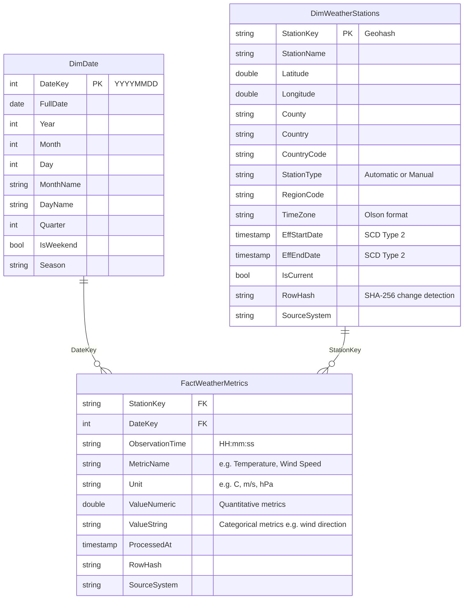

# Met Office Pipeline to Medallion Warehouse

## About Gabriel

I'm a Data Architect with over four years of professional experience, currently at **Camden Council** and previously at **Coca-Cola** where I spent over two years in the same discipline.

In my day-to-day work I bridge the gap between the business and engineering: I conduct stakeholder interviews with non-technical users to understand data needs, translate those needs into formal data models, and work alongside data engineers to deliver pipelines that meet them. I have experience designing end-to-end data pipeline architectures and am comfortable communicating at both the business and technical level.

This project is my implementation of those architectural skills in code: a production-style data pipeline running on GCP, built to demonstrate not just that I can design a system, but that I can build one.

---

## Project Overview

A fully automated, cloud-native ELT pipeline that ingests live weather observation data from the **UK Met Office API**, processes it through a **medallion architecture** (Landed → Bronze → Silver → Gold), and lands a star-schema analytical layer in **Delta Lake** on GCS.

The pipeline is orchestrated by **Apache Airflow** (Cloud Composer), with heavy transformation work offloaded to **Dataproc Serverless PySpark**. Infrastructure is defined in **Terraform** and deployed via a **Cloud Build** CI/CD pipeline on every push to `main`.

---

## Architecture

```
┌─────────────────────────────────────────────────────────────────────────┐
│                          GCP / Cloud Composer                           │
│                                                                         │
│  Met Office API                                                         │
│       │                                                                 │
│       ▼                                                                 │
│  ┌──────────┐     ┌──────────┐     ┌──────────┐     ┌──────────────┐  │
│  │  Landed  │────▶│  Bronze  │────▶│  Silver  │────▶│     Gold     │  │
│  │  (JSON)  │     │ (Delta)  │     │ (Delta)  │     │   (Delta)    │  │
│  └──────────┘     └──────────┘     └──────────┘     └──────┬───────┘  │
│                                                             │           │
│                                          ┌──────────────────┤           │
│                                          ▼                  ▼           │
│                                   DimWeatherStations  FactWeatherMetrics│
│                                   DimDate                               │
│                                                                         │
│  GCS Data Lake ──────────────────────────────────────────────────────  │
│  Orchestration: Cloud Composer (Airflow)                                │
│  Processing:    Dataproc Serverless (PySpark + Delta Lake)              │
│  IaC:           Terraform   CI/CD: Cloud Build                         │
└─────────────────────────────────────────────────────────────────────────┘
```

---

## Pipeline DAG Flow

The master DAG (`met_office_full_pipeline`) chains four sub-DAGs with a `TriggerDagRunOperator` pattern. Each sub-DAG accepts a `run_mode` parameter and uses a `BranchPythonOperator` to execute only the relevant branch, allowing individual layers to be re-run in isolation.

```
[Ingest Metadata] ──▶ [Bronze] ──▶ [Silver]
                                       │
                          ┌────────────┴──────────────────────────┐
                          ▼                                        ▼
               [Ingest Observations]                          [Gold DimDate]
                          │                                        │
                          ▼                                        ▼
               [Bronze Observations]                    [Gold DimWeatherStations]
                          │
                          ▼
               [Silver Observations] ──▶ [Gold FactWeatherMetrics]
```

The metadata layer runs first because the observations ingestion uses the silver station geohashes to know which stations to query — enforcing a data dependency at the pipeline level.

---

## Data Model (Gold Layer)

A star schema optimised for analytical queries. `FactWeatherMetrics` uses an unpivoted (EAV) structure — each observation is expanded into one row per metric — keeping the schema stable as measurement types change over time. `DimWeatherStations` is maintained as SCD Type 2, preserving the full history of any station attribute changes.



---

## Tech Stack

| Concern | Technology |
|---|---|
| Orchestration | Apache Airflow (Cloud Composer 2) |
| Transformation | PySpark on Dataproc Serverless |
| Table format | Delta Lake |
| Storage | Google Cloud Storage |
| Warehouse | BigQuery (Gold layer sink) |
| IaC | Terraform |
| CI/CD | Google Cloud Build |
| Ingestion | Python + Polars + `universal-pathlib` |
| Secrets | GCP Secret Manager (Airflow secrets backend) |
| Local dev | Docker Compose + Delta Docker image |

---

## Repo Structure

```
├── dags/                   # Airflow DAG definitions
│   ├── met_office_full_pipeline.py   # Master orchestrator
│   ├── met_office_api_ingestion.py
│   ├── met_office_bronze.py
│   ├── met_office_silver.py
│   └── met_office_gold.py
├── scripts/
│   ├── ingestion/          # Polars-based API ingestion to Landed
│   ├── bronze/             # PySpark: Landed → Bronze (Delta)
│   ├── silver/             # PySpark: Bronze → Silver (Delta streaming)
│   └── gold/               # PySpark: Silver → Gold star schema
├── common/                 # Shared utilities (Spark session factory, GCS helpers)
├── seeds/                  # Station seed CSV (390 UK stations, 10 monitored)
├── terraform/              # GCS bucket, BigQuery dataset, Composer environment
├── tests/                  # DAG integrity + transform unit tests
├── docker-compose.yaml     # Local Airflow + Spark environment
└── cloudbuild.yaml         # CI/CD: terraform apply → deploy DAGs to Composer
```

---

## Key Engineering Decisions

**Delta Lake throughout** — chosen over raw Parquet for ACID guarantees, schema evolution, and the `availableNow` streaming trigger, which gives micro-batch semantics without a continuously running Spark job.

**Incremental bronze writes via left-anti join** — each bronze run reads the existing Delta table and filters out already-ingested records by composite key (`station_geohash + datetime`), making runs idempotent without a full overwrite.

**SCD Type 2 on DimWeatherStations** — station metadata (coordinates, region, type) can change. Rather than overwriting, the gold load detects changes via row hash comparison and closes old records before appending new ones, preserving history for point-in-time analysis.

**Unpivoted fact table** — weather observations contain a mix of numeric and categorical metrics. An EAV model in `FactWeatherMetrics` keeps the schema stable as the Met Office adds or removes measurement types, at the cost of more rows per observation.

**BranchPythonOperator for run-mode routing** — sub-DAGs accept a `run_mode` config parameter (`metadata_only`, `observations`, `all`) so the master pipeline can trigger partial runs without duplicating DAG logic.

---

## Deploying to GCP

### Prerequisites

- A GCP project with billing enabled
- A [Met Office DataHub](https://datahub.metoffice.gov.uk) API key (free tier available)

### 1 — Enable required APIs

In the GCP console go to **APIs & Services → Enable APIs** and enable:
`Cloud Composer`, `Dataproc`, `Cloud Storage`, `BigQuery`, `Secret Manager`, `Cloud Build`.

### 2 — Create the Terraform state bucket

Terraform's remote state backend must exist before any build can run. In **Cloud Storage → Create bucket**, create a bucket named `YOUR_PROJECT_ID-met-office-datalake` in your chosen region. This same bucket later becomes the data lake.

### 3 — Store the Met Office API key in Secret Manager

In **Secret Manager → Create secret**, create a secret named exactly:

```
airflow-variables-MET_OFFICE_API_KEY
```

Paste your API key as the secret value. Airflow's Secret Manager backend resolves variables using this naming convention automatically.

### 4 — Connect Cloud Build to this repository

In **Cloud Build → Triggers → Connect Repository**, link your GitHub account and select this repo. Create a trigger with:

| Setting | Value |
|---|---|
| Event | Push to branch `main` |
| Configuration | `cloudbuild.yaml` (repo root) |
| Substitution `_REGION` | `europe-west2` (or your preferred region) |
| Substitution `PROJECT_NUMBER` | Your project's numeric ID (found on the GCP project dashboard) |

In **IAM**, grant the Cloud Build service account (`YOUR_PROJECT_NUMBER@cloudbuild.gserviceaccount.com`) the roles: `Editor`, `Composer Administrator`, `Secret Manager Secret Accessor`.

### 5 — Run the pipeline

Push to `main` or manually run the trigger in the console. Cloud Build will:

1. Run `terraform apply` — provisions GCS, BigQuery, and Cloud Composer (~15–20 min on first run)
2. Deploy all DAGs, scripts, and seed files to the Composer GCS bucket
3. Import Airflow variables into the Composer environment

Once complete, the Airflow UI URL appears under **Cloud Composer → Environments → Airflow webserver**. Open it and trigger the `met_office_full_pipeline` DAG.

---

## Tests

```bash
docker compose run --rm test
```

Covers DAG structural integrity (task count, dependency ordering), branch routing logic, and PySpark transform correctness for the silver and gold layers.
