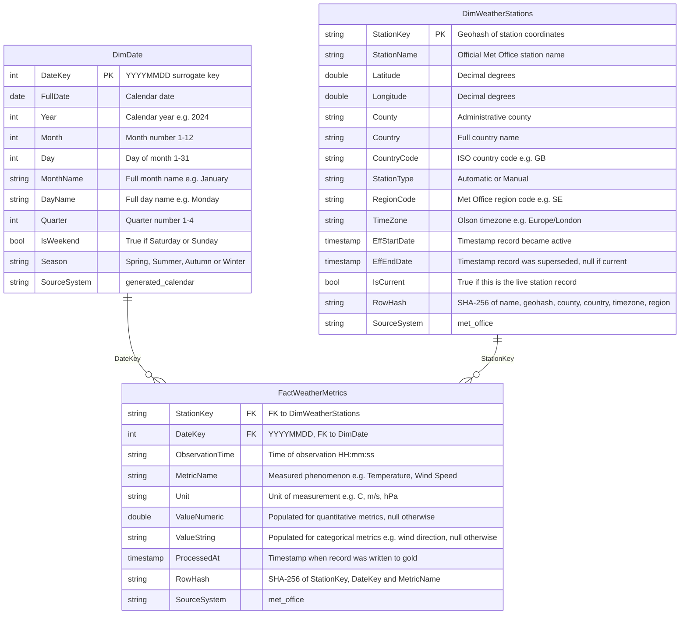

# Met Office Pipeline to Medallion Warehouse

## About Gabriel

I'm a Data Architect, currently at **Camden Council** and previously contracted at **Coca-Cola** where I spent over two years in the same discipline.

In my day-to-day work I bridge the gap between the business and engineering: I conduct stakeholder interviews with non-technical users to understand data needs, translate those needs into formal data models, and work alongside data engineers to deliver pipelines that meet them. I have experience designing end-to-end data pipeline architectures and am comfortable communicating at both the business and technical level.

This project is my implementation of those architectural skills in code: a production-style data pipeline running on GCP, built to demonstrate not just that I can design a system, but that I can build one.

---

## Project Overview

A fully automated, cloud-native ELT pipeline that ingests live weather observation data from the **UK Met Office API**, processes it through a **medallion architecture** (Landed → Bronze → Silver → Gold), and surfaces a star-schema analytical layer in **BigQuery**, backed by **Delta Lake** on GCS.

The pipeline is orchestrated by **Apache Airflow** (Cloud Composer), with heavy transformation work offloaded to **Dataproc Serverless PySpark**. Infrastructure is defined in **Terraform** and deployed via a **Cloud Build** CI/CD pipeline on every push to `main`.

---

## Architecture

```
┌──────────────────────────────────────────────────────────────────────────────┐
│                            GCP / Cloud Composer                              │
│                                                                              │
│   Met Office API                                                             │
│         │                                                                    │
│         ▼                                                                    │
│   ┌──────────┐   ┌──────────┐   ┌──────────┐   ┌──────────────────────┐   │
│   │  Landed  │──▶│  Bronze  │──▶│  Silver  │──▶│         Gold         │   │
│   │   JSON   │   │  Delta   │   │  Delta   │   │     Delta  +  BQ     │   │
│   └──────────┘   └──────────┘   └──────────┘   └──────────┬───────────┘   │
│                                                            │               │
│                                              ┌─────────────┘               │
│                                              │                             │
│                               ┌──────────────┴─────────────┐              │
│                               │                             │              │
│                    ┌──────────▼──────────┐   ┌─────────────▼────────────┐ │
│                    │     Delta (GCS)     │   │         BigQuery         │ │
│                    ├─────────────────────┤   ├──────────────────────────┤ │
│                    │ DimDate             │   │ DimDate                  │ │
│                    │ DimWeatherStations  │   │ DimWeatherStations       │ │
│                    │ FactWeatherMetrics  │   │ fact_weather_metrics     │ │
│                    └─────────────────────┘   └──────────────────────────┘ │
│                                                                            │
│   Orchestration  Cloud Composer (Airflow)                                  │
│   Compute        Dataproc Serverless (PySpark + Delta Lake)                │
│   IaC / CI·CD    Terraform + Cloud Build                                   │
└──────────────────────────────────────────────────────────────────────────────┘
```

---

## Pipeline DAG Flow

The master DAG (`met_office_full_pipeline`) chains four sub-DAGs with a `TriggerDagRunOperator` pattern. Each sub-DAG accepts a `run_mode` parameter and uses a `BranchPythonOperator` to execute only the relevant branch, allowing individual layers to be re-run in isolation.

```
[Ingest Metadata] ──▶ [Bronze] ──▶ [Silver]
                                       │
                          ┌────────────┴──────────────────────────┐
                          ▼                                        ▼
               [Ingest Observations]                          [Gold DimDate]
                          │                                        │
                          ▼                                        ▼
               [Bronze Observations]                    [Gold DimWeatherStations]
                          │
                          ▼
               [Silver Observations] ──▶ [Gold FactWeatherMetrics]
```

The metadata layer runs first because the observations ingestion uses the silver station geohashes to know which stations to query — enforcing a data dependency at the pipeline level.

---

## Data Model (Gold Layer)

A star schema optimised for analytical queries. `FactWeatherMetrics` uses an unpivoted (EAV) structure — each observation is expanded into one row per metric — keeping the schema stable as measurement types change over time. `DimWeatherStations` is maintained as SCD Type 2, preserving the full history of any station attribute changes.



---

## Tech Stack

| Concern | Technology |
|---|---|
| Orchestration | Apache Airflow on Cloud Composer 2 |
| Transformation | PySpark on Dataproc Serverless |
| Table format | Delta Lake |
| Storage | Google Cloud Storage |
| Warehouse | BigQuery |
| IaC | Terraform |
| CI/CD | Google Cloud Build |
| Ingestion | Python + Polars |
| Secrets | GCP Secret Manager (Airflow secrets backend) |
| Testing | pytest + PySpark |

---

## Repo Structure

```
├── dags/                   # Airflow DAG definitions
│   ├── met_office_full_pipeline.py   # Master orchestrator
│   ├── met_office_api_ingestion.py
│   ├── met_office_bronze.py
│   ├── met_office_silver.py
│   └── met_office_gold.py
├── scripts/
│   ├── ingestion/          # Polars-based API ingestion to Landed
│   ├── bronze/             # PySpark: Landed → Bronze (Delta)
│   ├── silver/             # PySpark: Bronze → Silver (Delta streaming)
│   └── gold/               # PySpark: Silver → Gold star schema
├── common/                 # Shared utilities (Spark session factory, GCS helpers)
├── seeds/                  # Station seed CSV (390 UK stations, 10 monitored)
├── terraform/              # GCS bucket, BigQuery dataset, Composer environment
├── tests/                  # DAG integrity + transform unit tests
├── docker-compose.yaml     # Local Airflow + Spark environment
└── cloudbuild.yaml         # CI/CD: terraform apply → deploy DAGs to Composer
```

---

## Key Engineering Decisions

**Cloud-first from the ground up** — a deliberate choice to build entirely on managed cloud services rather than self-hosted infrastructure. Every component — orchestration, compute, storage, secrets — is provisioned and operated by GCP. This removes the overhead of managing infrastructure and aligns with how modern data teams actually operate: ephemeral Dataproc Serverless batches spin up only when needed, Composer handles scheduling without a scheduler VM to babysit, and Terraform ensures the whole environment is reproducible from scratch. Building cloud-first was as much about learning the pattern as it was about the practicalities of this project.

**Delta Lake throughout** — having worked with Delta Lake at Coca-Cola, it was a natural choice and honestly a pleasure to use again. Strictly speaking it is overkill for a pipeline of this scale — raw Parquet would have done the job — but Delta's ACID guarantees, schema evolution, and native `MERGE` support make the code cleaner and the pipeline more robust than it would otherwise be. The `availableNow` streaming trigger is a particular highlight: it gives micro-batch semantics — processing only new data since the last checkpoint — without a continuously running Spark job, which matters for cost on a serverless compute model.

**Incremental bronze writes via left-anti join** — each bronze run reads the existing Delta table and filters out already-ingested records by composite key (`station_geohash + datetime`), making runs idempotent without a full overwrite.

**SCD Type 2 on DimWeatherStations** — station attributes (coordinates, region, classification) can be corrected or updated by the Met Office. No such change occurred during this project, but the cost of not designing for it is a silent overwrite that destroys history. Detecting changes via row hash comparison and closing superseded records before appending new ones means the dimension is always ready for point-in-time analysis, whether that need arises today or a year from now.

**Unpivoted fact table** — weather stations don't all report the same measurements: sensor capability varies by station type, and the Met Office periodically adds or retires metrics. An EAV model in `FactWeatherMetrics` means a station that doesn't report a given metric simply has no row for it, rather than a sea of NULL columns. The table schema stays fixed as the set of measured metrics changes — adding a new metric is a one-line change to the unpivot in the gold transform rather than a column migration and downstream backfill — and queries become metric-agnostic, filtering by `MetricName` rather than selecting a specific column.

**Master pipeline DAG for maintainability** — rather than one monolithic DAG, each layer (ingestion, bronze, silver, gold) is its own independently triggerable DAG. The master DAG chains them via `TriggerDagRunOperator`, passing a `run_mode` parameter that drives a `BranchPythonOperator` in each sub-DAG. This means any layer can be re-run in isolation without re-triggering the whole pipeline, and adding a new data source in future means adding a new sub-DAG rather than modifying a single growing file.

---

## Deploying to GCP

### Prerequisites

- A GCP project
- A [Met Office DataHub](https://datahub.metoffice.gov.uk) API key (free tier available)

Terraform handles the hard stuff — APIs, storage, BigQuery, Composer, and secrets are all provisioned automatically. Only three things need a human first.

---

### 1 — Create the GCP project

Note the **project ID** shown under the project name — this is used throughout the infrastructure.

---

### 2 — Grant the Cloud Build service account permissions

Terraform runs as the Cloud Build SA and needs elevated permissions to provision IAM bindings, Composer, and Secret Manager. This is a one-time bootstrap step.

In **IAM & Admin → IAM**, grant `YOUR_PROJECT_NUMBER@cloudbuild.gserviceaccount.com` one of:

- **Owner** — simplest option
- Or if you prefer least privilege: **Editor** + **Composer Administrator** + **Secret Manager Admin** + **Project IAM Admin** + **Service Usage Admin**

(The project number is shown on the GCP project dashboard.)

---

### 3 — Connect Cloud Build to this repository

In **Cloud Build → Repositories (2nd gen) → Create host connection**, authorise GCP to access your GitHub account. Once connected, click **Link Repository** and select this repo.

Then in **Cloud Build → Triggers → Create Trigger**:

| Setting | Value |
|---|---|
| Event | Manual invocation |
| Repository | the linked repo (2nd gen) |
| Branch | `main` |
| Configuration | Cloud Build configuration file → `cloudbuild.yaml` |
| Substitutions | none required — `PROJECT_ID`, `PROJECT_NUMBER`, and `_REGION` are injected automatically |

---

### 4 — Add the Met Office API key

In **Secret Manager**, you'll find the secret `airflow-variables-MET_OFFICE_API_KEY` has already been created by Terraform. Click it → **New Version** and paste your API key.

Airflow's Secret Manager backend resolves `Variable.get("MET_OFFICE_API_KEY")` to this secret automatically via the `airflow-variables-` prefix convention.

> If the secret doesn't exist yet, run the Cloud Build trigger first and come back — Terraform creates the shell, you add the value.

---

### 5 — Run the trigger and open Airflow

Click **Run** on the trigger. After ~30 minutes the build will complete. The `met_office_full_pipeline` DAG may trigger automatically on its first scheduled run — if not, open **Cloud Composer → Environments → Open Airflow UI** and trigger it manually.

The gold layer writes to both Delta Lake on GCS and native BigQuery tables in the `met_office_medallion_warehouse` dataset.

---

## Tests

```bash
docker compose run --rm test
```

Covers DAG structural integrity (task count, dependency ordering), branch routing logic, and PySpark transform correctness for the silver and gold layers.
